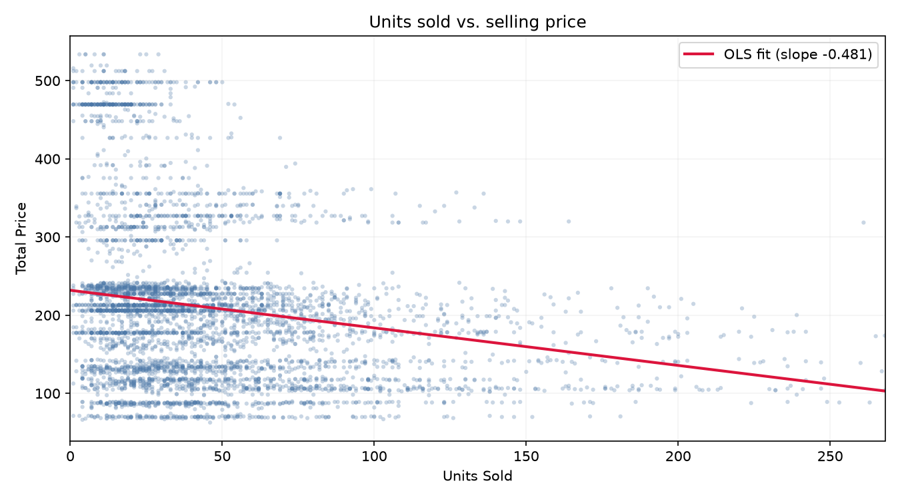
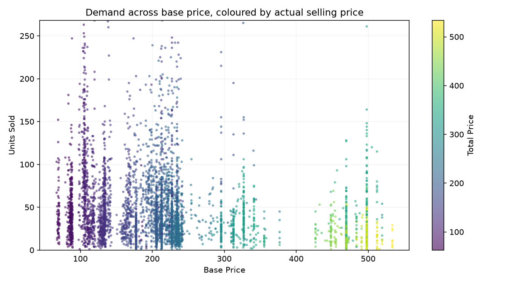
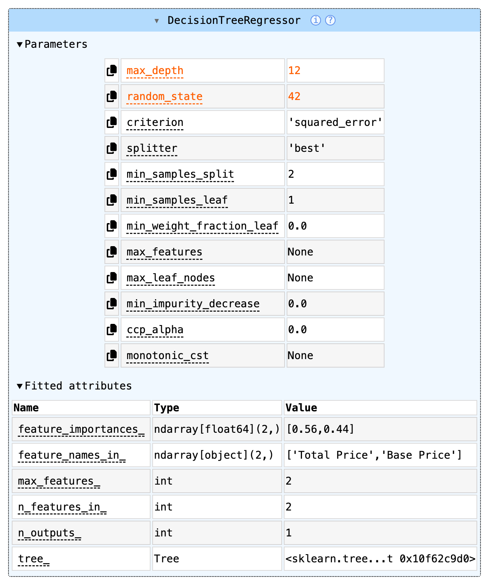

# Product Demand Prediction with Machine Learning

Predicts how many units a product will sell at a given price, so discounts can be set from data
instead of guesswork.

**Notebook:** [`product_demand_prediction.ipynb`](product_demand_prediction.ipynb)

---

## Dataset

[demand.csv](https://raw.githubusercontent.com/amankharwal/Website-data/master/demand.csv),
150,150 rows of store level sales.

| Column | Description | Role |
| --- | --- | --- |
| `ID` | Product ID | Identifier, excluded |
| `Store ID` | Specific store ID | Identifier, excluded |
| `Total Price` | Price the product was sold at, after discount | **Feature** |
| `Base Price` | Original price, before discount | **Feature** |
| `Units Sold` | Quantity demanded | **Target** |

### Feature selection

Every column was tested for association with `Units Sold` before being used.

* **H₀:** ρ = 0. No linear association with `Units Sold`.
* **H₁:** ρ ≠ 0. Some linear association exists.

Test: Pearson correlation, two sided, α = 0.05, n = 150,149. H₀ is rejected when p < α.

| Column | Direction | Strength (r) | Variance explained (r²) | p-value | Decision |
| --- | --- | --- | --- | --- | --- |
| `Total Price` | negative | **0.236** | 5.55% | < 0.001 | Reject H₀ |
| `Base Price` | negative | **0.140** | 1.96% | < 0.001 | Reject H₀ |
| `ID` | negative | 0.011 | 0.011% | 0.00004 | Reject H₀ |
| `Store ID` | negative | 0.004 | 0.002% | 0.090 | Fail to reject H₀ |

*Strength* is |r|, the size of the correlation. *Direction* holds its sign. *Variance explained*
is r², the share of variation in `Units Sold` that moves with the column.

**Price columns.** Both reject H₀. Both are negative, so demand falls as price rises. `Total Price`
is stronger, explaining 5.55% of the variation.

**`ID`.** Rejects H₀ at p = 0.00004, but explains only 0.011% of the variance. At n = 150,149 the
test detects effects far too small to be useful. Statistical significance and practical
significance are not the same thing, and here the effect size decides.

**`Store ID`.** Fails to reject H₀ at p = 0.090. No evidence of association.

**Both are dropped.** Neither explains a meaningful share of variance (r² < 0.02%), and both are
identifiers rather than measurements. A row's position in a list does not cause its sales.

Final features: **`Total Price`** and **`Base Price`**.

### Data cleaning

One row of 150,150 has a missing `Total Price`. It is dropped with `dropna()`, leaving
**150,149** rows. Imputing a single value out of 150,150 would change nothing measurable.

---

## Visualizations

Built with `plotly.express.scatter()`. The charts are interactive when the notebook runs in
Jupyter. The images below are static copies, because GitHub cannot display interactive Plotly
output.



Demand falls as price rises, and the OLS trendline confirms the negative slope. The points fan out
rather than following the line closely, so a linear model will underfit.



The vertical stripes are discrete price points, not a smooth range. A decision tree splits at
thresholds, so it fits this shape better than linear regression.

---

## The model

**`DecisionTreeRegressor(max_depth=12, random_state=42)`** from scikit-learn.

| Setting | Value | Reason |
| --- | --- | --- |
| Features | `Total Price`, `Base Price` | The only columns with real signal |
| Target | `Units Sold` | Quantity demanded |
| Split | 80 / 20, `train_test_split(random_state=42)` | 120,119 train, 30,030 test |
| `max_depth` | 12 | Chosen by comparing test R² across depths |
| `random_state` | 42 | Reproducible splits and fits |

### Model parameters

As scikit-learn displays the fitted model in Jupyter. Orange marks the two parameters that were set
by hand. Image file: `images/model-parameters-final.png`



The same information in full. Two parameters were set explicitly, the rest are scikit-learn
defaults.

| Parameter | Value | Meaning |
| --- | --- | --- |
| `max_depth` | **12** | Maximum number of questions from root to leaf. Set explicitly. |
| `random_state` | **42** | Fixes the random seed so results reproduce. Set explicitly. |
| `criterion` | `squared_error` | Splits are chosen to minimise squared error |
| `splitter` | `best` | Takes the best split found, not a random one |
| `min_samples_split` | 2 | A node needs at least 2 rows to split |
| `min_samples_leaf` | 1 | A leaf may hold as few as 1 row |
| `min_weight_fraction_leaf` | 0.0 | No minimum weight per leaf |
| `max_features` | `None` | All features considered at each split |
| `max_leaf_nodes` | `None` | No cap on the number of leaves |
| `min_impurity_decrease` | 0.0 | A split needs no minimum improvement |
| `ccp_alpha` | 0.0 | No cost complexity pruning |
| `monotonic_cst` | `None` | No monotonic constraints |

Attributes after fitting:

| Attribute | Value | Meaning |
| --- | --- | --- |
| `feature_importances_` | `[0.56, 0.44]` | `Total Price` drives 56% of the splits, `Base Price` 44% |
| `feature_names_in_` | `['Total Price', 'Base Price']` | Column names seen during fit |
| `n_features_in_` | 2 | Number of input features |
| `n_outputs_` | 1 | Single target |
| `tree_.max_depth` | 12 | Depth reached |
| `tree_.n_leaves` | 1,642 | Number of leaves, each holding one prediction |
| `tree_.node_count` | 3,283 | Total nodes in the tree |

Both features are used, so neither is redundant.

### Why a decision tree

1. **The relationship is stepped, not linear.** Demand holds flat across a price band, then drops
   at a threshold. A tree splits at those thresholds. A linear model fits one slope across all of
   them.
2. **It performs better here.** Against `LinearRegression` on the same split, the tree nearly
   triples explained variance and cuts average error by about 23%.
3. **No scaling needed.** Trees are unaffected by monotonic transforms of the inputs.
4. **The logic is readable.** Each prediction traces to a chain of price thresholds.

### Why this training method

A single 80/20 hold out split was used instead of cross validation. The test set holds 30,030 rows,
enough for a stable estimate, and cross validation would cost five times the compute for no real
gain in confidence.

`max_depth` was tuned on **test** R², not training R². Training R² always rises with depth, so
tuning on it would pick the most overfitted tree every time.

| `max_depth` | Train R² | Test R² |
| --- | --- | --- |
| 3 | 0.2093 | 0.2088 |
| 5 | 0.3266 | 0.3205 |
| 8 | 0.4178 | 0.4065 |
| 10 | 0.4623 | 0.4200 |
| **12** | **0.5067** | **0.4333** ← best |
| 15 | 0.5598 | 0.4071 |
| 20 | 0.5919 | 0.3795 |
| `None` (depth 27) | 0.5939 | 0.3765 |

Test R² peaks at depth 12 and falls after it. That is overfitting. The unrestricted tree scores
0.5939 on data it has seen and 0.3765 on data it has not.

---

## Evaluation

Measured on the 30,030 row test set with `model.score()` (R²) and `mean_absolute_error`.

| Model | Test R² (accuracy) | Train R² | Test MAE |
| --- | --- | --- | --- |
| **Decision tree, `max_depth=12`** | **0.4333** | 0.5067 | **25.13 units** |
| Decision tree, unrestricted | 0.3765 | 0.5939 | 25.50 units |
| Linear regression (baseline) | 0.1488 | n/a | 32.49 units |

**Accuracy of the final model: R² = 0.4333.** Price explains about 43% of the variation in units
sold. The average prediction is off by about 25 units.

R² compares the model against always guessing the average:

```
error when always guessing the average (51.9 units):  98,297,154
error of the model:                                   55,690,700
R² = 1 - 55,690,700 / 98,297,154 = 0.4333
```

### Limitations

R² of 0.43 is good for this feature set, not in absolute terms. Price is one demand driver among
many, and the dataset contains no others. There is no date or seasonality, no promotion flag, no
store location, no stock level, no competitor price. Most of the remaining 57% lives in those
missing columns.

The target is also right skewed, with a median of 35 units and a maximum of 2,876. Rare spikes
cannot be predicted from price and they raise the MAE.

Two further limits worth stating:

* **The model cannot extrapolate.** Training prices run from 41 to 562. Above 562 the tree returns
  the same value, about 5.5 units, for any price. A linear model would instead predict negative
  sales. Neither is usable outside the observed range.
* **It has no sense of time.** The dataset has no date column, so inflation and price drift cannot
  be modelled or corrected. A fixed price like 133 will mean something different in a few years,
  and the model has no way to know that. Using relative price, such as the discount ratio
  `Total Price / Base Price`, would be more robust because a ratio has no currency units.

The model is useful for **ranking candidate price points** against each other. It is not a
forecast of exact demand for a specific product on a specific day.

---

## Prediction example

```python
features = pd.DataFrame([[133.00, 140.00]], columns=["Total Price", "Base Price"])
model.predict(features)
```

Selling at **133.00** against a base price of **140.00** gives **42 units** expected.

The notebook writes this result to [`outputs/model_results.csv`](outputs/model_results.csv), and
the discount table below to [`outputs/price_sweep.csv`](outputs/price_sweep.csv), so the reported
numbers can be checked without running anything.

That prediction comes from 12 threshold questions, which narrow 120,119 training rows down to the
871 most similar past sales. Their average is 41.79 units.

Sweeping the discount for a product with a base price of 140:

| Total Price | Base Price | Predicted units sold | Predicted revenue |
| --- | --- | --- | --- |
| 140.00 | 140.00 | 71 | 9,940.00 |
| 133.00 | 140.00 | 42 | 5,586.00 |
| 125.00 | 140.00 | 42 | 5,250.00 |
| 115.00 | 140.00 | 49 | 5,635.00 |
| 105.00 | 140.00 | 106 | 11,130.00 |

The curve is **not monotonic**. A small discount to 133.00 predicts fewer sales than no discount.
Different price bands contain different products, so each band reports its own historical average.
The model has no rule forcing lower prices to sell more. Treat the output as a band level estimate.

---

## Project structure

```
product-demand-prediction/
├── product_demand_prediction.ipynb   # Full analysis, executed with outputs
├── README.md
├── requirements.txt
├── data/
│   └── demand.csv                    # Cached copy of the dataset
├── outputs/                          # Saved results, written by the notebook
│   ├── model_results.csv             # Scores and the required prediction
│   └── price_sweep.csv               # Predicted demand across discount levels
└── images/                           # Image exports, for viewing on GitHub
    ├── units-sold-vs-price.png
    ├── base-price-vs-demand.png
    ├── model-parameters-initial.png   # Model before tuning (max_depth=None)
    └── model-parameters-final.png     # Final model (max_depth=12)
```

## Running it

```bash
python3 -m venv .venv && source .venv/bin/activate
```

```bash
pip install -r requirements.txt
```

```bash
jupyter notebook product_demand_prediction.ipynb
```

The notebook reads `data/demand.csv` if present, and downloads it from the source URL if not.

## Possible improvements

- Add the missing demand drivers such as seasonality, promotions and store attributes. This is the
  largest available gain, bigger than any change of algorithm.
- Try `RandomForestRegressor` or gradient boosting, which average many trees and usually beat a
  single tree on noisy targets.
- Model `log(Units Sold)` to reduce the effect of the rare 1,000+ unit spikes.
- Use the discount ratio `Total Price / Base Price` as a feature. It encodes discount depth
  directly, and being a ratio it is unaffected by inflation.
